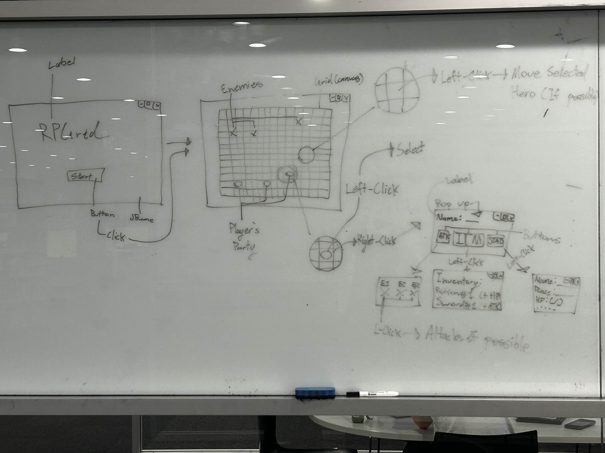

# RPGrid
RPGrid is a simple grid based RPG game developed by [Marvin Kelly](https://github.com/Suireyha) in Java for the COMP2000 unit at Macquarie University.
To view additional doccumentation for this project including some planning and other various documents check out the doc folder. **The justifications required as per the assignment specifications are at the bottom of this document!!** The source code for the project can be found in the creatively named src folder.

This repository is built off of the [foundation repo](https://github.com/Suireyha/DMTWMC/tree/week05) *(specifically branch week05!)* that was made collectively by the Macquarie University staff, along with my team for the unit including:
- [Caleb Chew](https://github.com/ChewOnThis)
- [William Milne](https://github.com/Will-Milne-MQ)
- [Tom Hannelly](https://github.com/tomhann)
- [Daniel Hardman](https://github.com/stalebiscuit)
- [Mickel](https://github.com/M1CK3L)

You can see each of our contributions and development of the original repository [here.](https://github.com/Suireyha/DMTWMC/tree/week05)
Credit for the Cient.java file also goes to Macquarie University, necessary as per Assignment 2.

## Description
RPGrid is a simple GUI based RPG combat game written in Java!
You control the blue characters, and your objective is to defeat the red characters with your party. There isn't currently a larger objective to the game, nor any win/loss handling BUT at least the enemies attack you now!! Even if it isn't so clear...
Pick up items, become stronger and slay your foe!
*Be careful not to have your ranger pick up a sword...*

## Instructions

### How To Compile/Run
**Command Line**
1. Navigate to the projects root folder on your machine
2. Compile all the source files with a java compiler of your choice
3. Run the program

**GUI**
1. Open the project folder in VS Code
2. Ensure you have installed Java, Language Support for Java, Maven for Java and Debugger for Java (all of these are extensions for VS-C)
3. Open Main.java and hit the arrow button to compile or right click somewhere and select "Run Java"

### How To Play
#### **Left Click**
Left clicking allows you to select characters, items or empty cells. By clicking on a **blue** character first, your next left click will be a context action performed by the selected character! Once you have a character selected, clicking on an item, cell or character will do the following:
- **Character**
    - If the clicked character is in range, your selected character will a ttack (you can make red characters attack you, and you can hit members of your party too!)
    - If it's not within range, a message will be displayed and your character will be deselected
- **Empty Cell**
    - If the clicked cell is within your character's move range (initiative + 3 tiles), the selected character will move to occupy that space. (Only functional for blue characters! Not red!)
    - If the clicked cell is outside of your character's movement range, and error message will be displayed and your character will be deselected
- **Item**
    - If your character is within range of the item, they pick it up and automatically equip it! You can see each character's items by right clicking them. Be careful to check what items do before picking them up, the Ranger is *really* bad with a sword...
    - If your character is outside of the item's reach, an error message will be displayed and your character will be deselected

#### **Right Click**
Right clicking items or characters allows you to display their name, description, stats and inventory (where applicable)! Items, players and enemies each display their own information, so feel free to check things out yourself.

## To Do:
- ~~Add combat~~
    - ~~Add a turn queue (ordered list of characters or make characters recursive so that it points to next character in turn)~~
    - ~~Add enemy logic~~
    - ~~Add character death~~
- Add win/loss screen
- Add more items/content
- Add character creation
- Add randomly generated levels
- Add boss fight
- Add ability to view, use and change items from inventory GUI 
- Add start button
- ~~Make inventory viewable from popup~~
- ~~Make items improve stats~~
- ~~Add attacking enemies~~
- ~~Add player movement~~
- ~~Create items (potions, weapons, armour)~~
- ~~Draw characters and indicate some things about them (role, and if they're a player or not)~~
- ~~Randomise player and enemy spawn locations~~
- ~~Create an interface for weapons, armour and potions respectively to support propper code design~~
- ~~Fix bug where hovering below bottom right corner of the grid gets index out of bounds error (non-fatal, just annoying)~~
- ~~Add players (Should have a class, race, name and attributes)~~
- ~~Add enemies~~
- ~~Add classes (Warrior, barbarian, ranger, mage, etc[?])~~
- ~~Add Items (Potions)~~
- ~~Add Weapons (Child of items)~~

## Known Bugs:
- ~~Character's stay in turn queue after being killed~~
- Players can hit themselves and/or each other (feature, not removing this one)
- An enemy player resets the turn queue from original initiative stats
- When it's one of the player character's turn, all of the player character's can take the turn instead of it being **THAT** character's turn.
- Screen may briefly white out during oponents first turn
- Game doesn't display new character location or splash text immediately after making a move (program is halted before it can redraw everything, my bug fixes failed ;~;)
- Health potions can take character's over their max health threshold

## Project Requirements:
*If you're marking this submission, this area is for you!*
### Streams in the Program
- Main.java
    - In Main.java, there's an ArrayList called turnQueue. It manages which character's turn it is based on their initiative at the beginning. Streams were used to sort this list by Character initiative.
    - sortTQ()
- Grid.java
    - The bulk of the streams in this program (as of writing this) exist at the end of Grid.java. (See following bullet points). Streams are used here largely to filter and collect objects and data about the relative distance between the origin cell or character (typically being called from enemy logic). In particular, the comparators in Stream.filter make this a far more efficient method of getting the data we're after compared to how I was previously handling (and still am for the player... you can see that hellscape in the rightClicked function in Grid.java). 
        - getCellsInRange(Cell origin, int range)
        - getValidMoves(Character character)
        - getAttackableTargets(Character attacker)
        - getClosestPlayer(Character enemy)
        - getBestMoveTowards(Character mover, Cell target)
    - initializeWeatherColors() uses streams to split up the weather data from Client.java and then take the average of the decimal point on the end.

### Lambdas in the Program
- Main.java
    - In Main.java, a special kind of PopUp is built to act as a loading screen while the program fetches the weather data. PopUp.java was originally designed to be called **EXCLUSIVELY** when the user right clicks on an item or player. By creating a new PopUp() constructor that includes a Consumer<T> interface, it's now possible to create PopUps for whatever unique purpose that may be required, as long as it's passed via a lambda. Without lambda support, any non-repeatable code (like the loading screen PopUp at the top of Main.java) would have to have been hard-coded into PopUp.java- which is inefficient.
    - Lambdas are used to a far more predictable extend during the stream operations in sortTQ() for passing rules to the comparator
    - Lambdas appear in removeFromTQ to provide rules to .removeIf
    - Lambdas appear in printQueue(), giving forEach its logic
    - Lambdas appear in processTurn() to give the Comparator its logic for character comparing health
- Grid.java
    - Lambdas in initializeWeatherColors() stream for string operation logic and maths
    - Lambdas in getCellsInRange(Cell origin, int range) stream for filter, mapping and mapToObj logic
    - Lambdas in getValidMoves(Character character) stream for filtering
    - Lambdas in getAttackableTargets(Character attacker) stream for
    - Lambdas in getClosestPlayer(Character enemy) stream for filtering, mapping and comparator
    - Lambdas in getBestMoveTowards(Character mover, Cell target) stream for comparison

### Use of Weather Data
- Grid.java
    - The weather data from Client.java is fetched by initializeWeatherColors() in Grid.java, this same method then uses a stream to split it up into parts between the whitespaces (so 5 parts in total, index 0 - 4). Then, in the same stream, the average of the last bit of each line (the decimal point number) is taken. If the average is less than .5, the grid for the game is drawn with a blue tint (for cold), if it's between .5 and .55 it's just the regular white board, and if it's greater than .55 the board is tinted orange. Local variable weatherTint stores the colour which Cell can get via the getter function getWeatherTint() during painting in Cell.java
- Cell.java
    - While painting, paint() in Cell.java makes a call to getWeatherTint in Grid.java, which returns the colour determined to be used for painting the grid based on the average of the last decimal point numbers from the list of lines. (Read the paragraph before this)

## Storyboard

## Discolsure of the use of Generative AI
Generative AI was used to a miniscule extent in this project.
Weapon.java, Item.java, Armour.java and Character.java **ALL* contain a draw() method. The logic for the switch/case and the shape.clear statements were written by me, but since I did not intend to burn hours of my time writing the Polygon.addPoint() maths to draw a few crude images of weapons, characters and other items- I employed AI to generate those sections.
*(The following AI slop was added during Assignment 2)*
AI was used to generate the if statement at the bottom paint() in Grid.java that creates the display for the character's HP and was also used to clean up processTurn() in Main.java.
I have left a comment everywhere AI was used outlining the use of AI.
AI used was [Anthropic's Claude AI.](https://claude.ai)
